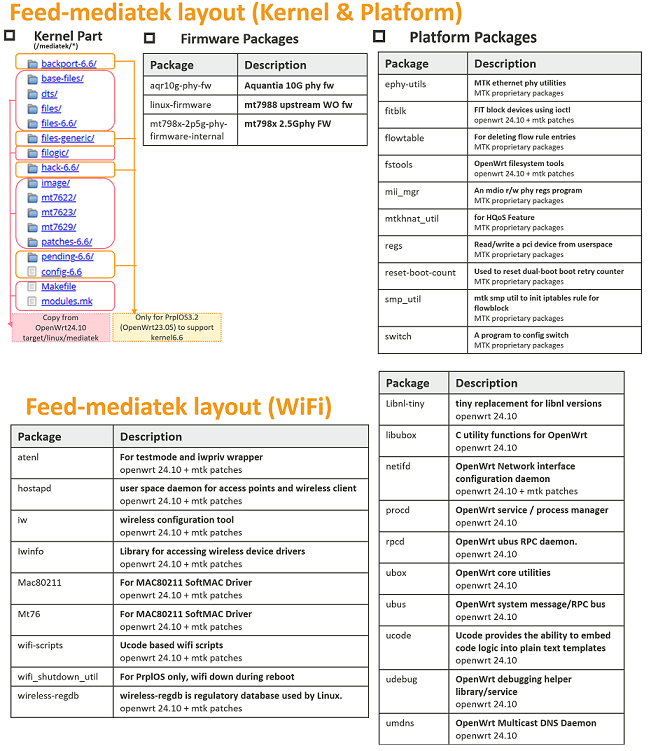

## feed-mediatek
This prplOS feed is for MediaTek **Kernel6.6** targets platform.

## Description
This repository can support [filogic880](https://www.mediatek.com/products/broadband-wifi/mediatek-filogic-880) series chipset, however you shall know the feature sets would be limited by the Prpl Feed Package readiness. (Ex: Wi-Fi7 MLO and Secure Boot..) 

## Getting Started with feed-mediatek
Based on 2025.05 PrplOS repository status, the latest branch of mainline is mainline-23.05. So we take this branch as an example.
Please be noted this prpl mediatek feed shall fit with PrplWare3.2/4.0/4.1 versions.

## PrplWare Example Build 
Taking mainlin-23.05 as an example, since prplos hasn't been upgraded to the OpenWrt 24.10 based version,
additional patches need to be applied to support Kernel 6.6.

#### 1. Clone prplOS
```
git clone https://gitlab.com/prpl-foundation/prplos/prplos.git -b mainline-23.05
cd prplos
```

#### 2. prplOS MTK Changes (Extra Patches)
Additional patches need to be applied to support Kernel 6.6:

**0001-prplos3.2_support_mozart_kernel6.6.patch**
- Apply the necessary prplos patch to support Kernel 6.6.
- Forcibly use the kernel target in feed_mediatek.
- Fix package dependency issues (WiFi scripts).
- Add the mtk_filogic profile.

**0002-disable_tr181_mcastd.patch**
- The tr181 prpl feed package would lead to a kernel crash on Kernel 6.6.

**0003-gen-fit-fix.patch**
- Fix random rootfs corruption in FIT image

**0004-add-netfilter-netlink-ftnl-package.patch**
- For manually deleting flow rule entries.

**0005-package-kernel-add-airoha-an8801sb-phy.patch**
- Add phy-airoha-an8801sb

**0005-uboot-envtools.patch**
- For dual image necessary patch
```
git clone https://git01.mediatek.com/filogic/prolos/prplos-feed-mediatek
for patch in prplos-feed-mediatek/autobuild/prplos/patches/*.patch; do patch -p1 < "$patch"; done
```

#### 3. Update the mtk_filogic.yml File
Select the fixed revision or just to follow the latest revision, execute the following command:
```
sed -i "s/revision: .*/revision: $(git ls-remote https://git01.mediatek.com/filogic/prolos/prplos-feed-mediatek refs/heads/master | awk '{print $1}')/" ./profiles/mtk_filogic.yml
```

This command retrieves the latest commit hash from the master branch of the specified remote repository and updates the revision field in the mtk_filogic.yml file accordingly.

Verify the Update
To confirm that the revision has been successfully updated, run the following command:

```bash
cat profiles/mtk_filogic.yml | grep -B 4 "revision"
```

You should see an output similar to the following, indicating the new revision:
```bash
feeds:
  - name: feed_mediatek
    uri: https://git01.mediatek.com/filogic/prolos/prplos-feed-mediatek
    tracking_branch: master
    revision: 60627bf7903f82dff7c0ae88d705a1166da22bde
```

#### 4. Configure prplOS with common prplMesh
```bash
./scripts/gen_config.py prpl mtk_filogic
```
Note: to include extra developer tools in the final image (tcpdump, strace, gdb), you can add "debug" as an extra profile while invoking the gen_config.py script.

#### 5. Build prplOS image.
```bash
make -j32
```
You can add the flag V=s to this command for more verbose output in case of problems.

### 5. Check the Final Image
As a result, you will get a full prplOS image with prplMesh for your platform
These can be used to upgrade the image on your target using uboot or sysupgrade.

**Path: bin/targets/mediatek/filogic** 

## Layout of feed_mediatek


## Feed-Mediatek Prpl Release
- Date: 2025-05-09
- Modified By: Evelyn Tsai (evelyn.tsai@mediatek.com)
### Release History
| Date       | OpenWrt Source   |
|------------|------------------|
| 2025.05.09 | Sync from [OpenWrt WiFi7 MP4.1 Release](https://git01.mediatek.com/plugins/gitiles/openwrt/feeds/mtk-openwrt-feeds/+/refs/heads/master/autobuild/unified/#filogic-880_860-wifi7-mp4_1-release-2025_04_25) |
| 2025.03.27 | Sync from [OpenWrt WiFi7 Beta Release](https://git01.mediatek.com/plugins/gitiles/openwrt/feeds/mtk-openwrt-feeds/+/refs/heads/master/autobuild/unified/#filogic-880-wifi7-beta-release-2025_03_07) |

## pWHM Version status
| pWHM version | Status |
|-------|-------|
| 6.34.x | Support Single hostapd process but NOT support MLO config |
| 7.6.x | support AP MLD, STA MLD, but NOT support WPS onboarding through MLD |

Please note that the latest pWHM v7.6.14 still has issues detecting the MLD capability of wiphy.
And also the WPS over MLO onboarding. You need to apply this patch manually to set up AP MLD

```
 src/nl80211/wld_nl80211_parser.c | 4 +++-
 1 file changed, 3 insertions(+), 1 deletion(-)
diff --git a/src/nl80211/wld_nl80211_parser.c b/src/nl80211/wld_nl80211_parser.c
index 44e586a..2efd7b6 100644
--- a/src/nl80211/wld_nl80211_parser.c
+++ b/src/nl80211/wld_nl80211_parser.c
@@ -1026,7 +1026,9 @@ swl_rc_ne wld_nl80211_parseWiphyInfo(struct nlattr* tb[], wld_nl80211_wiphyInfo_
     }
     NLA_GET_VAL(pWiphy->nStaMax, nla_get_u32, tb[NL80211_ATTR_MAX_AP_ASSOC_STA]);
     /* check MLO support */
-    pWiphy->suppMlo = (tb[NL80211_ATTR_MLO_SUPPORT] != NULL);
+    if(tb[NL80211_ATTR_MLO_SUPPORT])
+        pWiphy->suppMlo = true;
+
     s_parseIfTypes(tb, pWiphy);
     s_parseIfCombi(tb, pWiphy);
     s_parseWiphyBands(tb, pWiphy);

diff --git a/src/nl80211/wld_hostapd_cfgFile.c b/src/nl80211/wld_hostapd_cfgFile.c
index 3367d84..d8a3810 100644
--- a/src/nl80211/wld_hostapd_cfgFile.c
+++ b/src/nl80211/wld_hostapd_cfgFile.c
@@ -872,6 +872,7 @@ static bool s_setVapCommonConfig(T_AccessPoint* pAP, swl_mapChar_t* vapConfigMap
         swl_mapCharFmt_addValInt32(vapConfigMap, "wpa_group_rekey", pAP->rekeyingInterval);
         swl_mapChar_add(vapConfigMap, "wpa_ptk_rekey", "0");
         swl_mapChar_add(vapConfigMap, wpa_key_str, pAP->keyPassPhrase);
+        swl_mapChar_add(vapConfigMap, "wps_cred_add_sae", "1");
         // If sae_password is set, hostapd will use the sae_password value
         // for WPA3 connection and wpa_passphrase for WPA-WPA2. If sae_password
         // is not set, wpa_passphrase will be used for WPA3 connection
@@ -910,6 +911,7 @@ static bool s_setVapCommonConfig(T_AccessPoint* pAP, swl_mapChar_t* vapConfigMap
         swl_mapChar_add(vapConfigMap, "sae_groups", "19 20 21");
         swl_mapChar_add(vapConfigMap, "ieee80211w", "2");
         swl_mapCharFmt_addValInt32(vapConfigMap, "sae_pwe", isH2E ? is6g ? 1 : 2 : 0);
+        swl_mapChar_add(vapConfigMap, "wps_cred_add_sae", "1");
         if(wld_rad_checkEnabledRadStd(pRad, SWL_RADSTD_BE)) {
             swl_mapChar_add(vapConfigMap, "beacon_prot", "1");
         }
diff --git a/src/nl80211/wld_wpaSupp_cfgFile.c b/src/nl80211/wld_wpaSupp_cfgFile.c
index dac3b3f..0e1bccf 100644
--- a/src/nl80211/wld_wpaSupp_cfgFile.c
+++ b/src/nl80211/wld_wpaSupp_cfgFile.c
@@ -111,6 +111,7 @@ static swl_rc_ne s_setWpaSuppGlobalConfig(T_EndPoint* pEP, wld_wpaSupp_config_t*
      * to process received credentials internally and pass them over ctrl_iface
      * to external program */
     swl_mapChar_add(global, "wps_cred_processing", "2");
+    swl_mapChar_add(global, "wps_cred_add_sae", "1");
 
     T_EndPointProfile* epProfile = pEP->currentProfile;
     if((epProfile != NULL) &&
``` 


## Disclaimer
All modifications related to pWHM or PrplOS are MTK preliminary patches.
These patches do not guarantee quality and have only been verified to pass basic tests. 
For a complete pWHM integration that meets commercial quality standards, please ensure it is performed by a third-party software integration vendor.

## Roadmap
Next Revision Release: around 2025/6/M for secure boot
