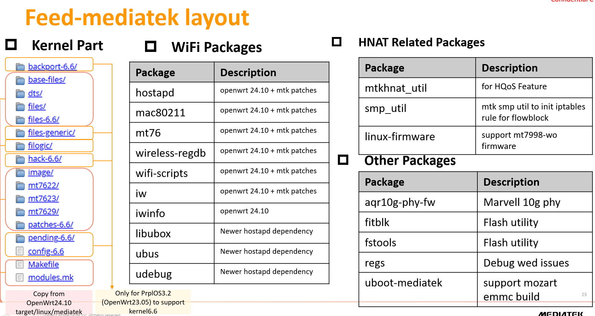

## feed-mediatek
This prplOS feed is for MediaTek **Kernel6.6** targets platform.

## Description
This repository can support [filogic880](https://www.mediatek.com/products/broadband-wifi/mediatek-filogic-880) series chipset, however you shall know the feature sets would be limited by the Prpl Feed Package readiness. (Ex: Wi-Fi7 MLO and Secure Boot..) 

## Getting Started with feed-mediatek
Based on 2025.01 PrplOS repository status, the latest branch of mainline is mainline-23.05. So we take this branch as an example. Please be noted our final goal is PrplOS4.0 which is based on OpenWrt24.10/Kernel 6.6 one.

### Image build steps

#### 1. Clone prplOS
```
git clone https://gitlab.com/prpl-foundation/prplos/prplos.git -b mainline-23.05
```
#### 2. prplOS Changes (Extra Patches)
Enter into the prplos folder and use the configuration command below:
```
cd prplos
```
##### 2-1 Support kernel6.6 
```patch
diff --git a/include/kernel-6.6 b/include/kernel-6.6
new file mode 100644
index 0000000000..f034d0754c
--- /dev/null
+++ b/include/kernel-6.6
@@ -0,0 +1,2 @@
+LINUX_VERSION-6.6 = .71
+LINUX_KERNEL_HASH-6.6.71 = 219715ba2dcfa6539fba09ad3f9212772f3507189eb60d77f8e89b06c32e724e

diff --git a/package/kernel/gpio-button-hotplug/src/gpio-button-hotplug.c b/package/kernel/gpio-button-hotplug/src/gpio-button-hotplug.c
index 522085bb2f..944ef7c5db 100644
--- a/package/kernel/gpio-button-hotplug/src/gpio-button-hotplug.c
+++ b/package/kernel/gpio-button-hotplug/src/gpio-button-hotplug.c
@@ -538,9 +538,14 @@ static int gpio_keys_button_probe(struct platform_device *pdev,
 			struct device_node *child =
 				of_get_next_child(dev->of_node, prev);
 
+#if (LINUX_VERSION_CODE >= KERNEL_VERSION(6,6,1))
+			bdata->gpiod = devm_fwnode_gpiod_get(dev,
+				of_fwnode_handle(child), NULL, GPIOD_IN,
+				desc);
+#else
 			bdata->gpiod = devm_gpiod_get_from_of_node(dev,
 				child, "gpios", 0, GPIOD_IN, desc);
-
+#endif
 			prev = child;
 		}
```
##### 2-2 Forcibly use kernel target in feed_mediatek 
```patch
diff --git a/include/target.mk b/include/target.mk
index 6514c535f2..92caaae215 100644
--- a/include/target.mk
+++ b/include/target.mk
@@ -143,11 +143,11 @@ ifneq ($(TARGET_BUILD)$(if $(DUMP),,1),)
   include $(INCLUDE_DIR)/kernel-version.mk
 endif
 
-GENERIC_PLATFORM_DIR := $(TOPDIR)/target/linux/generic
-GENERIC_BACKPORT_DIR := $(GENERIC_PLATFORM_DIR)/backport$(if $(wildcard $(GENERIC_PLATFORM_DIR)/backport-$(KERNEL_PATCHVER)),-$(KERNEL_PATCHVER))
-GENERIC_PATCH_DIR := $(GENERIC_PLATFORM_DIR)/pending$(if $(wildcard $(GENERIC_PLATFORM_DIR)/pending-$(KERNEL_PATCHVER)),-$(KERNEL_PATCHVER))
-GENERIC_HACK_DIR := $(GENERIC_PLATFORM_DIR)/hack$(if $(wildcard $(GENERIC_PLATFORM_DIR)/hack-$(KERNEL_PATCHVER)),-$(KERNEL_PATCHVER))
-GENERIC_FILES_DIR := $(foreach dir,$(wildcard $(GENERIC_PLATFORM_DIR)/files $(GENERIC_PLATFORM_DIR)/files-$(KERNEL_PATCHVER)),"$(dir)")
+GENERIC_PLATFORM_DIR ?= $(TOPDIR)/target/linux/generic
+GENERIC_BACKPORT_DIR ?= $(GENERIC_PLATFORM_DIR)/backport$(if $(wildcard $(GENERIC_PLATFORM_DIR)/backport-$(KERNEL_PATCHVER)),-$(KERNEL_PATCHVER))
+GENERIC_PATCH_DIR ?= $(GENERIC_PLATFORM_DIR)/pending$(if $(wildcard $(GENERIC_PLATFORM_DIR)/pending-$(KERNEL_PATCHVER)),-$(KERNEL_PATCHVER))
+GENERIC_HACK_DIR ?= $(GENERIC_PLATFORM_DIR)/hack$(if $(wildcard $(GENERIC_PLATFORM_DIR)/hack-$(KERNEL_PATCHVER)),-$(KERNEL_PATCHVER))
+GENERIC_FILES_DIR ?= $(foreach dir,$(wildcard $(GENERIC_PLATFORM_DIR)/files $(GENERIC_PLATFORM_DIR)/files-$(KERNEL_PATCHVER)),"$(dir)")
 
 __config_name_list = $(1)/config-$(KERNEL_PATCHVER) $(1)/config-default
 __config_list = $(firstword $(wildcard $(call __config_name_list,$(1))))

diff --git a/scripts/gen_config.py b/scripts/gen_config.py
index 94e20bc539..75c128af85 100755
--- a/scripts/gen_config.py
+++ b/scripts/gen_config.py
@@ -203,7 +203,7 @@ for ap in profile.get("additional_packages"):
         die(f"Error installing additional packages {packages_install} from {feed} feed")
 
 if profile.get("external_target", False):
-    if run_cmd(["./scripts/feeds", "install", profile["target"]]).returncode:
+    if run_cmd(["./scripts/feeds", "install", "-f", profile["target"]]).returncode:
         die(f"Error installing external target {profile['target']}")
 
 config_output = f"""CONFIG_TARGET_{profile["target"]}=y
```
##### 2-3 Fix package dependency issue (WiFi Scripts)
```patch
diff --git a/package/base-files/Makefile b/package/base-files/Makefile
index ce659d8684..828edf03b8 100644
--- a/package/base-files/Makefile
+++ b/package/base-files/Makefile
@@ -17,6 +17,7 @@ PKG_RELEASE:=$(COMMITCOUNT)
 
 PKG_FILE_DEPENDS:=$(PLATFORM_DIR)/ $(GENERIC_PLATFORM_DIR)/base-files/
 PKG_BUILD_DEPENDS:=usign/host ucert/host
+PKG_CONFIG_DEPENDS:=CONFIG_PACKAGE_wifi-scripts
 PKG_LICENSE:=GPL-2.0
 
 # Extend depends from version.mk
@@ -240,6 +241,8 @@ endif
 
 	$(if $(CONFIG_TARGET_PREINIT_DISABLE_FAILSAFE), \
 		rm -f $(1)/etc/banner.failsafe,)
+	$(if $(CONFIG_PACKAGE_wifi-scripts), \
+		rm -f $(1)/sbin/wifi,)
 endef
 
 ifneq ($(DUMP),1)


diff --git a/package/network/config/netifd/Makefile b/package/network/config/netifd/Makefile
index acfabf05e0..a2d6d3583e 100644
--- a/package/network/config/netifd/Makefile
+++ b/package/network/config/netifd/Makefile
@@ -9,6 +9,7 @@ PKG_SOURCE_DATE:=2024-01-04
 PKG_SOURCE_VERSION:=c18cc79d50002ab8529c21184aceb016c61ac61c
 PKG_MIRROR_HASH:=0a1080ade51dc4a55249c8899d4d384f665e0d21075adab24ea23a2808165e05
 PKG_MAINTAINER:=Felix Fietkau <nbd@nbd.name>
+PKG_CONFIG_DEPENDS:=CONFIG_PACKAGE_wifi-scripts
 
 PKG_LICENSE:=GPL-2.0
 PKG_LICENSE_FILES:=
@@ -44,6 +45,8 @@ define Package/netifd/install
 	$(CP) ./files/* $(1)/
 	$(INSTALL_DIR) $(1)/etc/udhcpc.user.d/
 	$(CP) $(PKG_BUILD_DIR)/scripts/* $(1)/lib/netifd/
+	$(if $(CONFIG_PACKAGE_wifi-scripts), \
+		rm $(1)/lib/netifd/netifd-wireless.sh,)
 endef
 
 $(eval $(call BuildPackage,netifd))
```
##### 2-4 Add mtk_filogic profile
```
diff --git a/profiles/mtk_filogic.yml b/profiles/mtk_filogic.yml
new file mode 100644
index 0000000000..b4e02b016b
--- /dev/null
+++ b/profiles/mtk_filogic.yml
@@ -0,0 +1,50 @@
+---
+profiles:
+  - mediatek_mt7988a-arcadyan-mozart
+target: mediatek
+subtarget: filogic
+external_target: True
+description: Build image for MediaTek / Arcadyan Mozart board
+feeds:
+  - name: feed_mediatek
+    uri: https://git01.mediatek.com/filogic/prolos/prplos-feed-mediatek
+    tracking_branch: master
+    revision: 48c745fdb229b7f156379113aae6be33d3ea9335
+
+packages:
+  - mediatek
+  - kmod-mt7996-firmware
+  - kmod-mt7996-233-firmware
+  - kmod-mt7996e
+  - kmod-br-netfilter
+  - kmod-ipt-offload
+  - ucode-mod-uci
+  - netifd
+  - wifi-scripts
+  - wpa-cli
+  - hostapd-utils
+  - libudebug
+  - iptables
+  - iptables-mod-conntrack-extra
+  - iptables-mod-extra
+  - iptables-mod-ipopt
+  - mtkhnat_util
+  - mt7988-2p5g-phy-firmware
+  - mt7988-wo-firmware
+  - u-boot-mt7988_arcadyan_mozart
+  - aqr10g-phy-firmware
+  - smp_util
+  - regs
+  - mt76-test
+  - tcpdump
+  - mpstat
+  - tftp
+
+diffconfig: |
+  CONFIG_TARGET_MULTI_PROFILE=y
+  CONFIG_TARGET_DEVICE_mediatek_filogic_DEVICE_mediatek_mt7988a-rfb=y
+  CONFIG_TARGET_DEVICE_mediatek_filogic_DEVICE_mediatek_mt7988d-rfb=y
+  CONFIG_TARGET_DEVICE_mediatek_filogic_DEVICE_arcadyan_mozart=y
+  CONFIG_BUSYBOX_CONFIG_LSPCI=y
+  CONFIG_PACKAGE_CFG80211_TESTMODE=y
+  # CONFIG_PACKAGE_wpad-basic-mbedtls is not set
```

### 3. Configure prplOS with common prplMesh
```bash
./scripts/gen_config.py prpl mtk_filogic
```
Note: to include extra developer tools in the final image (tcpdump, strace, gdb), you can add "debug" as an extra profile while invoking the gen_config.py script.

### 4. Build prplOS image.
```bash
make -j32
```
You can add the flag V=sc to this command for more verbose output in case of problems.

### 5. Check the Final Image
As a result, you will get a full prplOS image with prplMesh for your platform
These can be used to upgrade the image on your target using uboot or sysupgrade.

**Path: bin/targets/mediatek/filogic** 


## Layout of feed_mediatek


## How to update prplMesh/pwhm version in prplOS
After the new version of the prplmesh/pwhm has been released, we need to update it in prplOS.

### Updating prplMesh and pwhm version in prplOS:
You need to update prpl.yml in PrplOS (prplos/profiles/prpl.yml)

Example: profiles: prpl: prplMesh: change to version 4.3
```patch
  - name: feed_prpl
    uri: https://gitlab.com/prpl-foundation/prplos/feeds/feed-prpl.git
    tracking_branch: main
    revision: main@fd9ebdd9f22495f2da721a0e8b3f8b26cf9efb40
```

Example: profiles: feed_wifi_core: update pwhm to v7.3.1
```patch
  - name: feed_wifi_core
    uri: https://gitlab.com/prpl-foundation/prplos/feeds/feed_wifi_core.git
    revision: v1.2.2@b11c720f6841717f3ed765a33afad0297fbe082f
```

## Roadmap
2025/Q1/E will have the next stable release version
